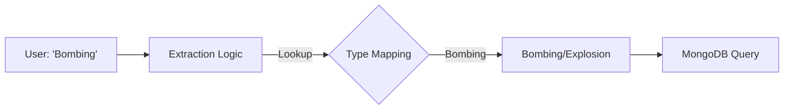

# PLAN-gtd-data-mismatch

## Task: Fix GTD Data Mismatch in Queries

**Goal**: Ensure queries for "Bombing", "Religious Figures", and other specific GTD fields return the correct data by fixing extraction mapping and ordering issues.

## 1. Context Analysis (Root Cause)

The zero-result responses are caused by two specific issues in `server/utils/mongoDB/contextExtractor.js`:

1.  **Exact Match Failure (Attack Types)**:
    *   The code extracts "Bombing" from the query.
    *   The MongoDB filter uses `{ attacktype1_txt: /^Bombing$/i }` (Exact Match).
    *   **Reality**: The database value is `"Bombing/Explosion"`.
    *   **Result**: 0 matches.

2.  **Order of Precedence Failure (Target Types)**:
    *   The `targetTypes` array list "Religious" *before* "Religious Figures/Institutions".
    *   The code iterates and stops at the *first* match.
    *   Query "Religious Figures" matches the shorter keyword "Religious" first.
    *   The system searches for `{ targtype1_txt: /^Religious$/i }`.
    *   **Result**: 0 matches (Database value is "Religious Figures/Institutions").

## 2. Proposed Solution plan

We will implement a robust mapping strategy within `contextExtractor.js` that decouples "extraction keywords" from "database values".

### Phase 1: Create Value Mappings
Define specific dictionaries that map user-friendly keywords to the **EXACT** string found in the GTD database.

**Attack Type Diagram:**

### Phase 2: Fix Extraction Logic
1.  **Reorder Arrays**: Sort matching arrays by **Length (Descending)**. This ensures "Religious Figures/Institutions" is checked before "Religious".
2.  **Use Mappings**: Update the loop to look up the extracted value in our new mapping dictionary before setting the condition object.

## 3. Implementation Steps

- [ ] **Step 1: Define Mappings**
    *   Add `attackTypeMappings` constant: `{ 'bombing': 'Bombing/Explosion', ... }`
    *   Add `targetTypeMappings` constant.

- [ ] **Step 2: Update Arrays**
    *   Update `targetTypes` to include all full strings.
    *   Sort `targetTypes` and `attackTypes` by length descending at runtime or definition.

- [ ] **Step 3: Modify Extraction Loop**
    *   Update `parseNaturalLanguageQuery` loops for Attack/Target/Weapon types.
    *   Logic: `conditions.field = mappings[extracted.toLowerCase()] || extracted`.

- [ ] **Step 4: Update Filter Builder**
    *   (Optional) Ensure regex allows for these exact values. The current `^value$` logic is correct *if* we provide the correct value.

## 4. Verification Check

| Query | Current Result | Expected Result |
|-------|----------------|-----------------|
| "Attacks was Bombing" | 0 | ~100+ (Exact count) |
| "Target was Religious Figures" | 0 | ~27 (Exact count) |
| "ByType Assassination" | (Likely Works) | Works |

## 5. Agent Assignment
*   **Agent**: `orchestrator` (or current active agent)
*   **Skill**: `node-mongo` logic refinement.
